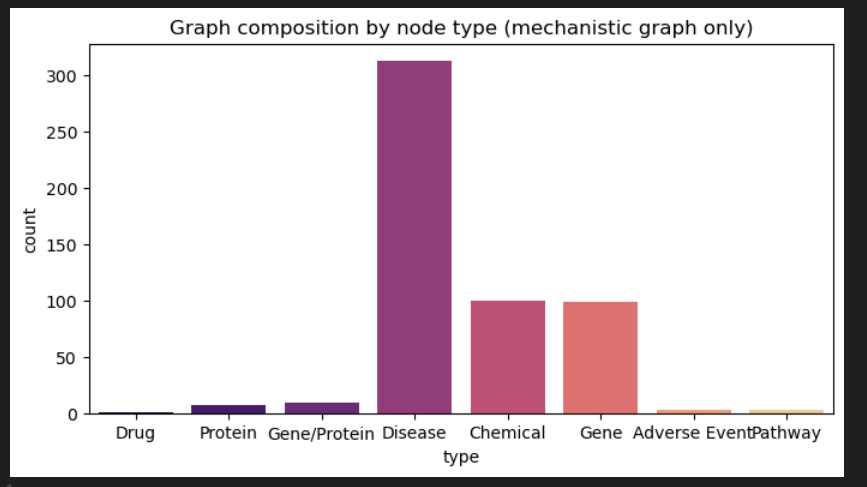
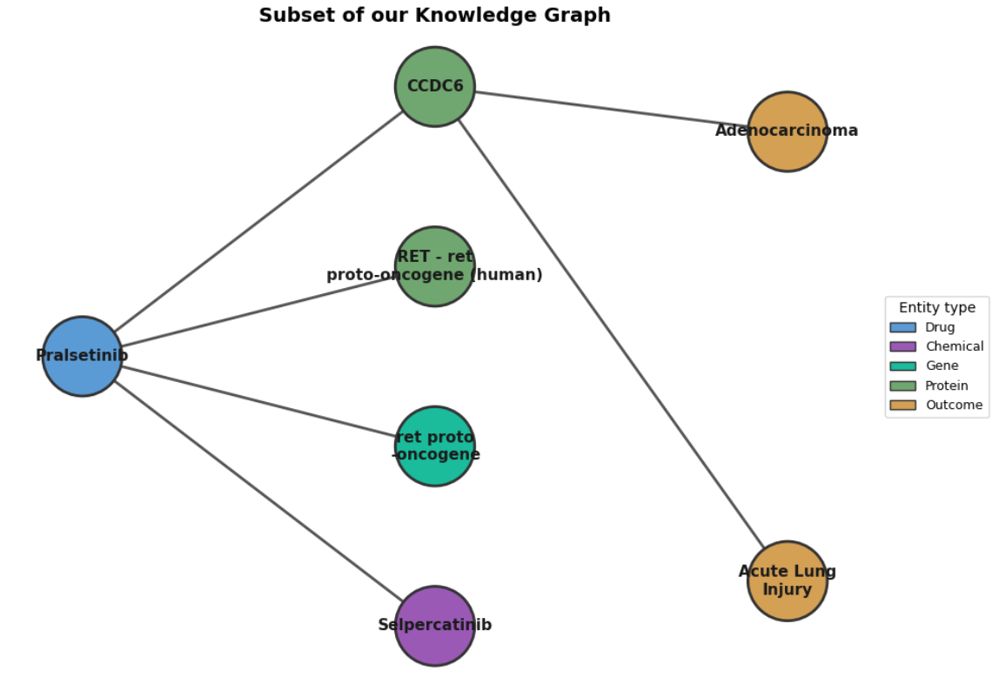
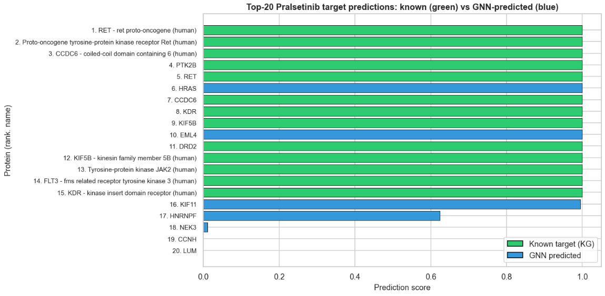

---
    layout: default
    title: Home
    ---
    # Predicting Unknown Side Effects of the Cancer Drug Pralsetinib
    **A Neuro-Symbolic Approach to Drug Safety using Knowledge Graphs**
    
    **Team Members:** Ryan Cao, Suchit Bhayani, Ishaan Bal, Taranvir Chima
    
    ---
    
    ## Abstract
    We study Pralsetinib off-target effects using a neuro-symbolic pipeline centered on a knowledge graph (KG). Our goal is to replace a drug-centric star topology with a mechanistic, multi-hop structure that supports interpretable reasoning (Drug → Protein → Outcome). We construct a baseline KG from PubChem Bioactivity, indications, clinical trials, literature mining, and co-occurrence signals, then enrich it with Gene Ontology (GO) biological processes to enhance mechanistic understanding.
    
    We employ three KG embedding models—TransE, ComplEx, and RotatE—trained on this enriched KG to predict novel links (triples) representing potential off-target effects. Each model is optimized via hyperparameter tuning, and their performance is evaluated using metrics like MRR and Hits@k on a validation set of triples excluded from the training KG.
    
    
    
    
    
    Our results demonstrate the feasibility of using KG embeddings to identify plausible off-target effects, with ComplEx generally showing the strongest predictive performance. The enriched KG and the link predictions provide a foundation for further investigation into the mechanistic pathways of Pralsetinib's side effects.
    
